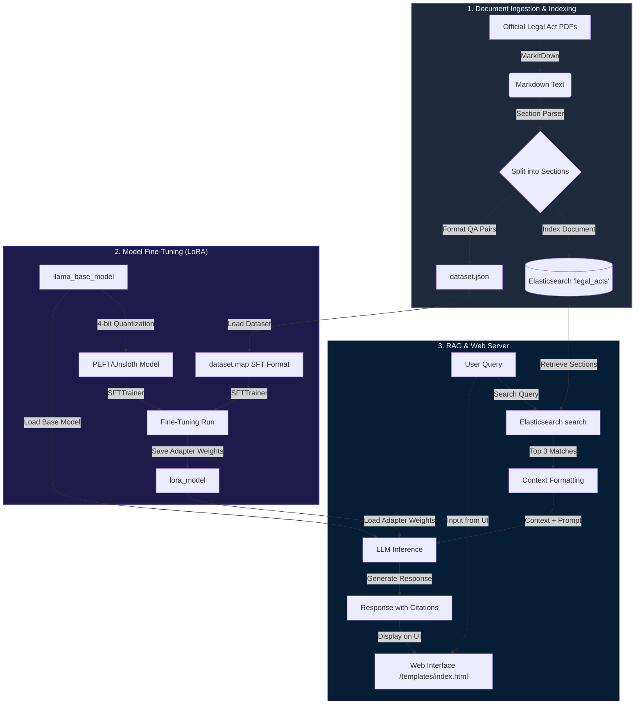

# LexAI: Legal RAG Chatbot with Fine-Tuning

LexAI is an end-to-end Legal Question-Answering system that combines **Retrieval-Augmented Generation (RAG)** with a **fine-tuned Llama model**. The system indexes official legal acts in **Elasticsearch** for document retrieval and leverages a fine-tuned LoRA adapter to generate accurate legal advice citing specific acts and section numbers.

---

## 🏗️ System Architecture

The following diagram illustrates the three main pipelines of the LexAI system:
1. **Document Ingestion & Indexing Pipeline**: Parses PDF documents into sections and indexes them in Elasticsearch while generating a QA dataset.
2. **Fine-Tuning Pipeline**: Fine-tunes a base Llama model on the generated QA dataset.
3. **Retrieval-Augmented Generation (RAG) Server**: Handles user queries, retrieves context, performs inference, and serves the web UI.



---

## 🌟 Key Features

- **Document Parsing**: Automatic PDF extraction using Microsoft's `MarkItDown` library (optimized with deduplication to run twice as fast on Windows).
- **Hybrid System Status**: Real-time status checks showing whether Elasticsearch and the LLM engine are online or offline.
- **Strict Grounded RAG**: Chatbot answers are strictly grounded in official law sections retrieved via Elasticsearch, preventing hallucinations and staying faithful to the document.
- **Optimized Fine-Tuning**: Uses standard PEFT (Hugging Face) with 4-bit quantization, with built-in fast acceleration support via `Unsloth` (4-5x faster), automatically handling GPU absence gracefully.
- **Interactive UI**: A premium dark-themed UI featuring glassmorphism design, smooth message transitions, suggested questions, and real-time word-by-word streaming typing effects.
- **Pipeline Automation**: A single automation PowerShell runner (`run_pipeline.ps1`) to orchestrate extraction, training, and deployment steps.

---

## 📂 Project Structure

```text
Finetuning/
│
├── Act_Elastic search/         # Directory containing source legal PDFs
├── templates/
│   └── index.html             # Premium glassmorphic frontend UI
├── app.py                     # Flask web server (serves web UI and API endpoints)
├── extract_and_index.py       # Converts PDFs, creates Elasticsearch indices, generates QA dataset
├── fine_tune.py               # Fine-tunes the base Llama model using LoRA
├── run_pipeline.ps1           # PowerShell orchestrator for automation
├── dataset.json               # Generated QA dataset from source documents
├── .gitignore                 # Version control ignores for large weights and dependencies
└── README.md                  # System documentation and architecture guide
```

*Note: Large model weights (`llama_base_model/`, `lora_model/`), python environments (`finetune_env/`), and the local Elasticsearch bundle (`elasticsearch-8.17.0/`) are excluded from Git to maintain a clean and lightweight repository.*

---

## 🛠️ Setup & Installation

### Prerequisites
- Python 3.10 or higher
- Windows OS (for running the `.ps1` automation script)
- CUDA-compatible GPU (strongly recommended for LLM training and fast inference; otherwise, fallback Mock mode can be used)

### 1. Environment Setup
Create a virtual environment named `finetune_env` and install the necessary dependencies:
```powershell
python -m venv finetune_env
.\finetune_env\Scripts\Activate.ps1
pip install flask elasticsearch transformers datasets trl peft bitsandbytes markitdown torch
```
*(Optional) For accelerated training, install Unsloth:*
```powershell
pip install "unsloth[colab-new] @ git+https://github.com/unslothai/unsloth.git"
```

### 2. Elasticsearch Installation
1. Download Elasticsearch 8.x (the project is configured for local deployment).
2. Extract it to the root project directory under `elasticsearch-8.17.0`.
3. Start the Elasticsearch server:
   ```powershell
   .\elasticsearch-8.17.0\bin\elasticsearch.bat
   ```
4. Verify it's running locally on `http://127.0.0.1:9200`.

---

## 🚀 Running the Pipeline

Use the PowerShell runner `run_pipeline.ps1` to execute steps in the pipeline:

### Step 1: Text Extraction & Indexing
Extract sections from PDFs in `Act_Elastic search` folder, index them in Elasticsearch, and generate the QA dataset (`dataset.json`):
```powershell
.\run_pipeline.ps1 -Action extract
```

### Step 2: Model Fine-Tuning
Fine-tune the local base model (`llama_base_model`) on the generated dataset. The weights will be saved to `lora_model`:
```powershell
.\run_pipeline.ps1 -Action train
```

### Step 3: Run the Server
Launch the Flask chatbot server.

**Standard Mode** (Runs on GPU if available, falls back to CPU automatically):
```powershell
.\run_pipeline.ps1 -Action serve
```

**Mock Mode** (For fast UI testing without loading LLM weights; uses mock responses and connects to Elasticsearch):
```powershell
.\run_pipeline.ps1 -Action serve-mock
```

---

## 💬 API Endpoints

- **`GET /`**: Renders the chatbot user interface.
- **`GET /api/status`**: Checks and returns status of Elasticsearch and LLM engine (`MOCK` vs `GPU`).
- **`GET /api/acts`**: Aggregates and lists unique legal acts indexed in Elasticsearch.
- **`POST /api/chat`**: Accepts a JSON body `{"query": "User question"}` and returns a RAG response containing the LLM-generated reply and source citations.
