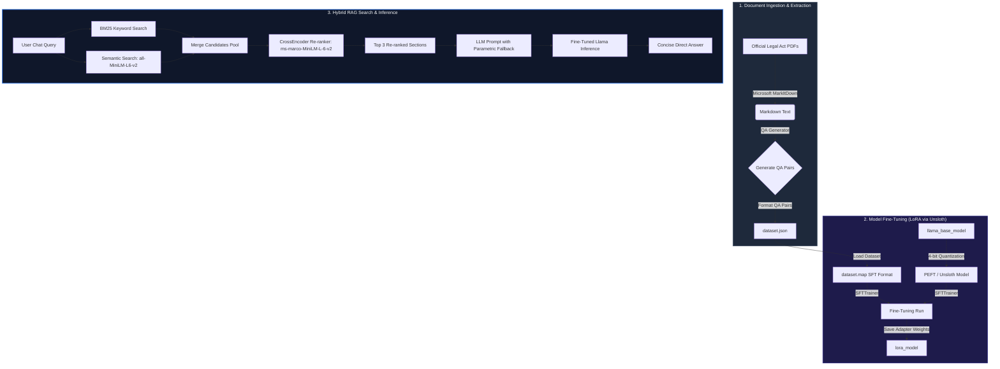

# Llama Fine-Tuning Pipeline with PDF-to-JSON Dataset Generation

This repository provides an automated pipeline to extract text from official legal PDF documents, generate a structured Question-Answering (QA) training dataset, and fine-tune a Llama model using Unsloth.

---

## 🏗️ System Architecture

The following diagram illustrates the complete ingestion, fine-tuning, and upgraded hybrid search inference pipeline:



---

## 🌟 Key Features

- **Microsoft MarkItDown Toolkit**: Automatic, fast PDF text extraction and parsing.
- **QA Dataset Generation**: Automatically generates instructions and output answers from the parsed PDF contents.
- **Hybrid RAG Search Pipeline**: Integrates BM25 keyword search and dense semantic vector search via `sentence-transformers/all-MiniLM-L6-v2`.
- **Cross-Encoder Re-ranking**: Uses `cross-encoder/ms-marco-MiniLM-L-6-v2` to score and rank retrieved documents, ensuring the highest relevance is passed to the LLM.
- **Parametric Fallback & Conciseness**: LLM prompt resolves context conflicts, outputs preamble-free direct answers, and falls back to fine-tuned parametric weights when the retrieved context is ambiguous.
- **Optimized Fine-Tuning**: Integrates with `Unsloth` to perform fast 4-bit LoRA fine-tuning of Llama models.
- **CPU-Safe Validation Check**: Gracefully checks for PyTorch CUDA support before starting GPU training, displaying warnings instead of crashing on CPU-only machines.
- **Pipeline Orchestration**: Includes a simple PowerShell automation script (`run_pipeline.ps1`) to orchestrate extraction, training, and running the server.

---

## 📂 Project Structure

```text
Finetuning/
│
├── source_pdfs/              # Directory containing source legal PDFs
├── extract_to_json.py        # Extracts PDF text and generates dataset.json
├── fine_tune.py              # Fine-tunes the base Llama model using Unsloth
├── run_pipeline.ps1          # PowerShell orchestrator to run extraction/training
├── dataset.json              # Generated QA dataset from source documents
├── .gitignore                # Version control ignores for large weights and environments
└── README.md                 # System documentation and architecture guide
```

*Note: Large model weights (`llama_base_model/`, `lora_model/`) and the python virtual environment (`finetune_env/`) are excluded from Git to keep the repository clean and lightweight.*

---

## 🛠️ Setup & Installation

### Prerequisites
- Python 3.10 or higher
- Windows OS (for running the `.ps1` runner script)
- CUDA-compatible GPU (required for active LLM training)

### 1. Environment Setup
Create a virtual environment named `finetune_env` and install the requirements:
```powershell
python -m venv finetune_env
.\finetune_env\Scripts\Activate.ps1
pip install transformers datasets trl peft bitsandbytes markitdown torch
```

### 2. Accelerated Fine-Tuning Setup (Unsloth)
Install the `unsloth` library within your active virtual environment:
```powershell
pip install "unsloth[colab-new] @ git+https://github.com/unslothai/unsloth.git"
```

---

## 🚀 Running the Pipeline

Use the PowerShell runner `run_pipeline.ps1` to execute the steps:

### Step 1: Text Extraction to JSON
Extract text from PDFs in the `source_pdfs` folder and generate the QA dataset (`dataset.json`):
```powershell
.\run_pipeline.ps1 -Action extract
```

### Step 2: Model Fine-Tuning
Fine-tune the local base model (`llama_base_model`) using Unsloth on the generated `dataset.json`. The fine-tuned weights will be saved to `lora_model`:
```powershell
.\run_pipeline.ps1 -Action train
```
